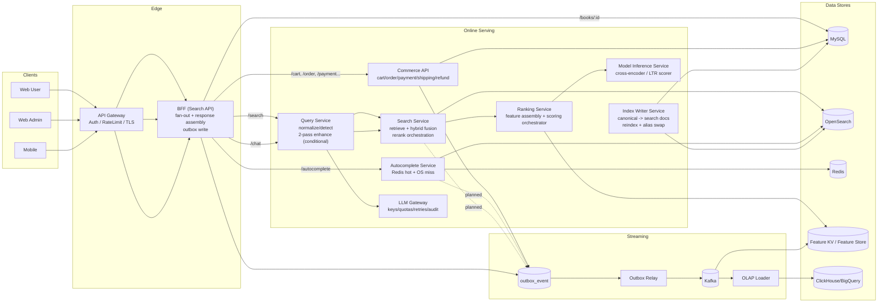
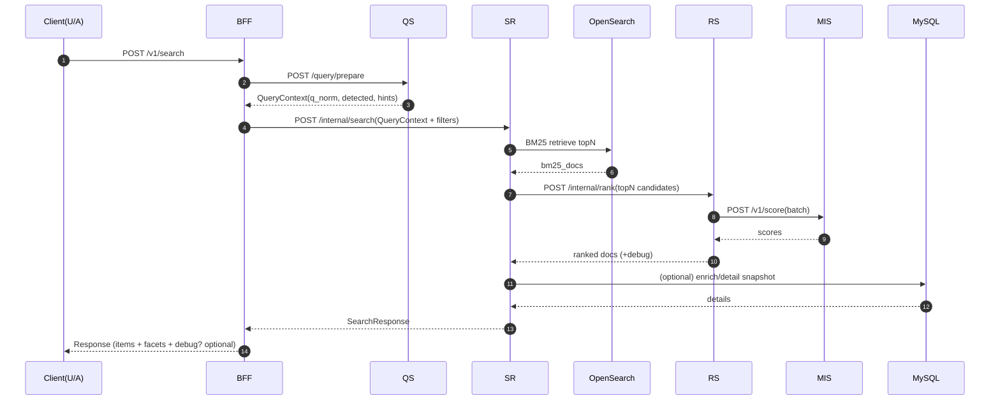
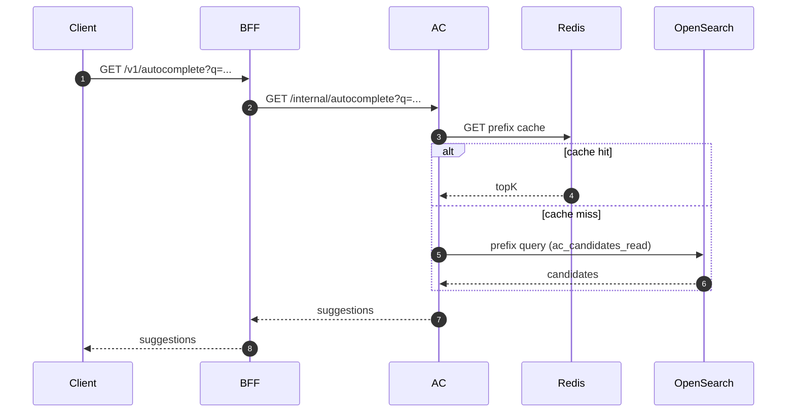

# BSL Architecture (v3) — Production-ready Blueprint

> This document is the **single source of truth** for BSL’s system shape:
> services, sync/async call paths, transaction boundaries, and ops loops.
>
> **Current state:** Web(User/Admin) → **Query Service direct-call** (legacy)
>
> **Target state:** Web(User/Admin) → **API Gateway** → **BFF** → (QS/SR/AC/Commerce)  
> Internal services are not internet-facing.

---

## 1) Design principles (the rules we don’t break)

1. **Single entrypoint for clients:** all client traffic goes through **Gateway + BFF**.
2. **Read path is stateless & degradable:** search/autocomplete/chat can **degrade** (quality ↓) but must **respond**.
3. **Write path is transactional per service:** each write is atomic **inside one DB**. Cross-service consistency is via **outbox + events + sagas**.
4. **Contracts are versioned:** OpenAPI/JSON Schema **compat gates** in CI.
5. **Observability is built-in:** request_id + trace_id propagate end-to-end; every stage has latency budgets.

---

## 2) System map (logical)

---

## 3) “Fan-out” means what?

**Fan-out = one request triggers multiple downstream calls** in parallel/sequence, then the caller **assembles** one response.

Example: **BFF /search**
- calls **QS (prepare)** to normalize/detect
- calls **SR (search)** to retrieve & rerank
- optionally calls **DB (detail enrichment)** or policy endpoints
- returns one unified payload to the client

Fan-out must be guarded by:
- per-downstream **timeout budgets**
- **circuit breakers** (degrade mode)
- **idempotency** for side effects (outbox)

Current implementation note:
- **Event emit ownership is primarily in BFF** (search/autocomplete click/impression paths).
- AC/SR direct outbox emit remains a planned hardening path and is not the default production path yet.

---

## 4) Service responsibilities (clear boundaries)

### 4.1 API Gateway (GW)
- TLS termination, routing
- user/admin auth, rate limiting
- forwards trace headers (W3C trace context)

### 4.2 BFF (Search API)
- **single client entrypoint**
- issues `request_id`, propagates `trace_id`
- **fan-out orchestration** + response assembly
- writes domain events to **outbox_event** (search impressions, ac selects, etc.)
- enforces contracts and policy selection (feature flags/experiments)

### 4.3 Query Service (QS) — deterministic 1-pass + conditional 2-pass
- `prepare`: normalize/detect/canonicalKey
- `enhance`: spell(T5)/rewrite/understanding (+ optional RAG hints) **only when gated**
- caching: normalize cache, enhance cache (optional)
- emits debug fields (why enhanced / what strategy)

### 4.4 Search Service (SR) — online search orchestrator (Hybrid included)
- doc BM25 retrieval (`books_doc_v*`)
- optional vector retrieval (`books_vec_v*` or chunks) + **Fusion (RRF)**
- calls RS/MIS to rerank (topN→topK), but must **degrade safely**
- debug/explain output for Admin playground
- emits impression/click/dwell events (via outbox)

### 4.5 Autocomplete Service (AC)
- Redis hot-prefix cache (p99 defense)
- OS prefix query fallback (miss)
- current production event emit is handled by BFF (`/autocomplete/select`); AC-native emit is optional/planned

### 4.6 Ranking Service (RS)
- assembles feature vectors (query-doc, ctr/popularity, freshness, commerce signals)
- calls MIS for scoring (cross-encoder / LTR)
- returns scored results + debug bundle (feature snapshots, model version, reason codes)

### 4.7 Model Inference Service (MIS)
- stateless inference endpoints with:
  - concurrency limits, timeouts, warmup
  - optional dynamic batching
  - model version routing (active/canary) driven by model_registry
- hosts: cross-encoder reranker, LTR scorer (e.g., LambdaMART→ONNX)

### 4.8 Commerce API (COM)
- cart/order/payment/shipping/refund
- all writes are atomic in **one DB transaction**
- cross-service side effects (webhooks, stock sync, email, etc.) via **outbox + events**

### 4.9 LLM Gateway (LLMGW)
- centralized place to call external LLM providers
- key/quotas/retries, audit logs, prompt templates, cost controls

### 4.10 Outbox Relay Service
- reads pending `outbox_event` rows and publishes them to Kafka
- enforces idempotent publish (`dedup_key`) and replay-safe retry semantics
- isolates transport failures from online read/write paths

### 4.11 Index Writer Service
- owns canonical-to-search document projection (`material*` -> `books_doc_*`)
- executes reindex jobs with checkpointing and alias cutover (`books_doc_read/write`)
- supports blue/green index rollout without direct client impact

### 4.12 OLAP Loader Service
- consumes analytics/event streams (Kafka) and materializes OLAP tables
- normalizes event schema versions and backfills replay windows
- powers dashboard/reporting pipelines without coupling to online APIs

---

## 5) Synchronous call flows (who calls whom)

### 5.1 Search (happy path)

### 5.2 Search (fallback / degrade)
- **vector retrieval fails** → SR returns **BM25-only**
- **MIS/RS timeout** → SR returns **fused order without rerank**
- **0 results / low confidence** → SR calls QS `/enhance`, retries once with `q_final`

### 5.3 Autocomplete

### 5.4 Chat (RAG)
- BFF `/chat` → QS `/chat` orchestrates:
  - normalize/rewrite → retrieve chunks via SR/OS → rerank chunks via MIS (optional) → LLMGW generate with citations
- Stream mode: QS relays LLMGW token stream (`meta`/`delta`/`done`), and BFF proxies SSE without token splitting.
- Internal debug path: QS `/internal/rag/explain` exposes lexical/vector/fused/selected traces with rerank/rewrite reason codes.

---

## 6) Transactions, consistency, and “multi-service calls”

### 6.1 Reads (QS/SR/RS/MIS/AC)
These are **query-only** flows:
- no distributed transaction needed
- correctness model: **best-effort + degrade safe**
- guarantees: **bounded latency** and **consistent tracing**

### 6.2 Writes (Commerce/Admin ops)
This is where “multi-service calls” can cause pain — so we avoid 2PC.

**Rule:** a user write request must be committed in **one service’s DB transaction**.  
Cross-service effects are handled asynchronously.

#### Pattern: Outbox + Relay (recommended baseline)
1. Service writes business rows **and** `outbox_event` **in the same DB transaction**
2. Relay publishes to Kafka with `dedup_key` idempotency
3. Consumers update their own stores (feature store, OS indexes, email, etc.)

#### When you need workflows (Saga)
For flows like “Order → Payment → Stock reserve → Shipment”:
- keep **Order state machine** in Commerce DB
- each step emits events (`order_created`, `payment_approved`, …)
- each consumer performs local transaction and emits next event
- compensations: cancel order / release stock, etc.

This avoids “one request calling N services in one transaction.”

---

## 7) Data, indexing, and ops loops

### 7.1 Raw → Canonical → Index (blue/green)
- Raw ingest: `raw_node(payload_hash, node_id)` for idempotency
- Canonical: upsert into `material/agent/concept/material_*`
- Index build: create `books_doc_v{N}` → validate → alias swap → mark READY/ACTIVE

### 7.2 Synonyms/normalization publishing
- `synonym_set` is versioned in DB
- publishing pipeline updates OS analyzers and triggers safe reindex if required
- rollback = republish previous version

---

## 8) Ranking: LTR + cross-encoder (production pattern)

### 8.1 Why 2-stage is the default
- **LTR (LambdaMART):** cheap, feature-based, explainable (topN)
- **Cross-encoder:** expensive but precise (topK subset)

### 8.2 Offline eval regression gates (CI blocking)
Datasets:
- Golden (fixed) + Shadow (recent) + Hard (typo/chosung/series)

Metrics:
- NDCG@10, MRR@10, Recall@100
- 0-result-rate, latency proxy (rerank call rate, p99 risk)

---

## 9) Commerce architecture note (monolith vs modular)

Current roadmap treats **Commerce as one “Commerce API” service** (a modular monolith internally):
- easier to maintain strong transactional integrity (orders/payment/shipment/ledger)
- avoids cross-service distributed transactions early

Later split (only if needed):
- keep **Order** as orchestration root
- split Payment/Shipment as separate services with **saga + outbox**

---

## 10) Observability & SRE essentials
- OpenTelemetry tracing, W3C propagation (gateway → bff → internal)
- Metrics: p95/p99, error rate, cache hit rate, Kafka lag
- Logs: JSON structured, PII redaction
- Runbooks: reindex failures, OS snapshot restore, DB restore, Kafka DLQ replay

---

## 11) Local development ports (fixed)
- web-admin: **5173**
- web-user: **5174**
- search-service: **18087**
- autocomplete-service: **8081**
- query-service: **8001**

---

## Appendix — Minimal API surface (target)

### Public (BFF)
- `POST /search` (alias: `/v1/search`)
- `GET /autocomplete` (alias: `/v1/autocomplete`)
- `GET /books/{id}` (alias: `/v1/books/{id}`)
- `POST /chat` (alias: `/v1/chat`)
- `POST /v1/cart/*`, `POST /v1/order/*`, `POST /v1/payment/*` ...

### Internal (service-to-service)
- QS: `/query/prepare`, `/query/enhance`, `/chat`, `/internal/rag/explain`
- SR: `/search` (alias: `/internal/search`), `/internal/explain`
- AC: `/autocomplete` (alias: `/internal/autocomplete`)
- RS: `/rerank` (alias: `/internal/rank`)
- MIS: `/v1/score`, `/v1/models`
