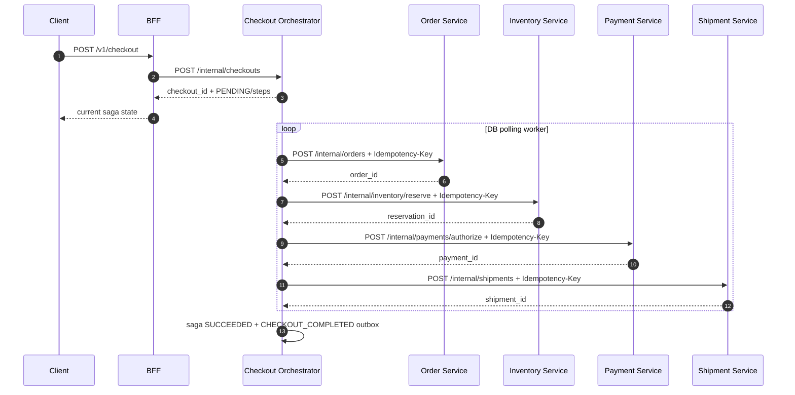
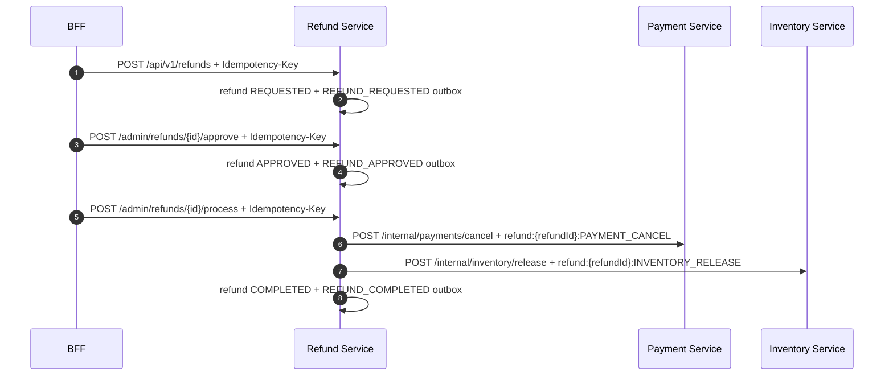

# Commerce MSA Saga

## Purpose

Commerce MSA exists to learn and validate distributed write workflow design without pretending that a global transaction exists.

The split is intentionally limited to checkout/order/payment/inventory/shipment/refund. Search services and most legacy commerce surfaces are not part of this migration.

## Service Composition

| Service | Port | Responsibility |
|---|---:|---|
| `bff-service` | 8088 | Single public entrypoint |
| `checkout-orchestrator-service` | 8091 | Checkout saga state machine and recovery |
| `order-service` | 8092 | Order create/read |
| `payment-service` | 8093 | Mock payment authorization/cancel |
| `inventory-service` | 8094 | Stock reservation/release |
| `shipment-service` | 8097 | Mock shipment request/cancel |
| `refund-service` | 8098 | Refund request/approval/process orchestration |

External clients never call internal services directly.

## Checkout Flow



Core checkout is HTTP orchestration. Kafka/outbox is reserved for follow-up processing.

## DB Schema Summary

Checkout-orchestrator:

| Table | Purpose |
|---|---|
| `checkout_saga` | One row per checkout workflow |
| `checkout_saga_step` | One row per workflow step, with status, retry, idempotency key, response/error payload |
| `outbox_event` | Follow-up domain events for relay/Kafka later |

Domain services:

| Service | Main tables |
|---|---|
| order | `orders`, `order_lines`, `idempotency_record` |
| payment | `payment_authorization`, `payment_cancellation`, `idempotency_record` |
| inventory | `book_stock`, `inventory_reservation`, `inventory_reservation_line`, `idempotency_record` |
| shipment | `shipment_request`, `idempotency_record` |
| refund | `refund`, `refund_item`, `refund_event`, `outbox_event`, `idempotency_record` |

Refund flow:



Payment cancel is the refund pivot side effect. If payment cancel times out, refund-service reconciles through payment-service idempotency lookup before deciding whether the refund is `COMPLETED` or `UNKNOWN`.

## Transaction Boundary

There is no global transaction.

Each step follows this shape:

1. Short transaction: claim step as `PROCESSING`, set saga `PROCESSING/current_step`.
2. No transaction: call downstream HTTP API with `Idempotency-Key`.
3. Short transaction: store `SUCCEEDED`, `FAILED_RETRYING`, `UNKNOWN`, or `MANUAL_REVIEW_REQUIRED`.

HTTP calls must not happen inside a DB transaction.

## Local Invariant Ownership

| Resource | Owner | Local defense |
|---|---|---|
| Duplicate checkout | checkout-orchestrator | unique `checkout_key` |
| Duplicate step side effect | downstream owner | unique `idempotency_key` |
| Order row | order-service | idempotency replay |
| Payment authorization | payment-service | idempotency replay |
| Stock | inventory-service | guarded `UPDATE ... WHERE available_quantity >= ?` |
| Shipment request | shipment-service | idempotency replay |

The orchestrator does not read stock or balance and later decide to write it. It calls the owning service command and accepts the result.

## Step Classification

| Step | Category | Recovery policy | Notes |
|---|---|---|---|
| `CREATE_ORDER` | `COMPENSATABLE` | `BACKWARD` | Provisional order record |
| `RESERVE_STOCK` | `COMPENSATABLE` | `BACKWARD` | Reservation can be released |
| `AUTHORIZE_PAYMENT` | `COMPENSATABLE` | `BACKWARD` | MVP authorization hold can be cancelled |
| `REQUEST_SHIPMENT` | `RETRIABLE` | `FORWARD` | MVP mock is idempotent/retriable |

If payment is changed from authorization to capture/final charge, that step becomes pivot-like.

## Pivot Rule

Pivot transaction means the workflow crossed a point that is hard or unsafe to roll back.

Examples:

| Operation type | Classification |
|---|---|
| check/simulate/reserve/park | compensatable |
| capture/post/send/finalize | pivot |
| status update/event/dashboard projection | retriable |

Ordering rule:

1. Put reversible checks/reservations before pivot.
2. Put irreversible external effects as late as possible.
3. After pivot success, prefer forward retry/manual recovery over automatic rollback.
4. If reversal is needed, model it as a new business transaction with operator reason/approval context.

## UNKNOWN and Reconciliation

Timeout is not permanent failure.

When the downstream side effect may have happened but the response is missing:

1. Mark step `UNKNOWN`.
2. Retry by querying downstream with the same idempotency key.
3. If downstream returns stored success, mark step `SUCCEEDED`.
4. If still unknown/retryable, keep retrying until max retry.
5. If exhausted, mark `MANUAL_REVIEW_REQUIRED`.

Pivot `UNKNOWN` must be reconciled before compensation.

## Status Model

Saga statuses:

| Status | Meaning |
|---|---|
| `PENDING` | Saga created, worker not started |
| `PROCESSING` | Worker is executing a step |
| `SUCCEEDED` | All steps succeeded |
| `FAILED_RETRYING` | A retryable step failed |
| `MANUAL_REVIEW_REQUIRED` | Automatic retry exhausted or non-retryable failure |
| `CANCELLING` | Backward compensation is running |
| `CANCELLED` | Compensation finished |
| `CANCEL_FAILED` | Compensation failed and operator action is required |

Step statuses:

| Status | Meaning |
|---|---|
| `READY` | Eligible to run |
| `PROCESSING` | Claimed by worker |
| `SUCCEEDED` | Downstream command succeeded |
| `UNKNOWN` | Timeout or unclear side effect |
| `FAILED_RETRYING` | Retryable failure |
| `MANUAL_REVIEW_REQUIRED` | Step needs operator action |
| `COMPENSATING` | Compensation in progress |
| `COMPENSATED` | Compensation done |
| `SKIPPED` | Not required |

## Idempotency Rules

Forward keys are generated once by checkout-orchestrator and persisted on `checkout_saga_step.idempotency_key`.

| Step | Key |
|---|---|
| `CREATE_ORDER` | `checkout:{checkoutId}:CREATE_ORDER` |
| `RESERVE_STOCK` | `checkout:{checkoutId}:RESERVE_STOCK` |
| `AUTHORIZE_PAYMENT` | `checkout:{checkoutId}:AUTHORIZE_PAYMENT` |
| `REQUEST_SHIPMENT` | `checkout:{checkoutId}:REQUEST_SHIPMENT` |

Manual retry reuses the same key. Compensation uses separate keys ending in `:compensate`.

Compensation keys follow reverse workflow order:

| Compensation | Key |
|---|---|
| shipment cancel | `checkout:{checkoutId}:REQUEST_SHIPMENT:compensate` |
| payment cancel | `checkout:{checkoutId}:AUTHORIZE_PAYMENT:compensate` |
| inventory release | `checkout:{checkoutId}:RESERVE_STOCK:compensate` |

Downstream services reject:

| Case | Result |
|---|---|
| missing `Idempotency-Key` | `400` |
| same key and same payload | replay stored response |
| same key with different operation | `409` |
| same key with different payload hash | `409` |
| in-progress duplicate | deterministic `409` |

## Worker Locking

The worker uses conditional claim:

```sql
UPDATE checkout_saga_step
SET status = 'PROCESSING', started_at = COALESCE(started_at, ?), updated_at = ?
WHERE id = ?
  AND status = ?
  AND (next_retry_at IS NULL OR next_retry_at <= ?);
```

Only the worker that updates one row can call the downstream service.

## Outbox Event Catalog

Outbox events are follow-up domain events, not checkout commands.

Primary consumers:

| Consumer type | Use |
|---|---|
| settlement | later ledger/settlement integration |
| notification | email/push/SMS |
| analytics | product/event analytics |
| dashboard | admin projection |
| replay | operational replay |
| audit | recovery inspection |

Current implemented events:

| Event | Source |
|---|---|
| `CHECKOUT_STARTED` | checkout creation |
| `CHECKOUT_COMPLETED` | all steps succeeded |

Planned event catalog:

| Event | Purpose |
|---|---|
| `CHECKOUT_STEP_FAILED` | follow-up alert/projection |
| `CHECKOUT_MANUAL_REVIEW_REQUIRED` | ops queue |
| `CHECKOUT_CANCELLING` | cancellation timeline |
| `CHECKOUT_CANCELLED` | cancellation follow-up |
| `CHECKOUT_CANCEL_FAILED` | ops escalation |
| `REFUND_REQUESTED` | refund follow-up |
| `REFUND_APPROVED` | refund follow-up |
| `REFUND_COMPLETED` | refund follow-up |
| `REFUND_FAILED` | ops escalation |

## Failure Mode Experiment

Payment, inventory, and shipment support:

```bash
curl -X POST http://localhost:8093/internal/admin/failure-mode \
  -H 'Content-Type: application/json' \
  -d '{"mode":"SUCCESS_BUT_TIMEOUT"}'
```

## Observability

All Commerce MSA Spring services expose actuator Prometheus metrics at `/actuator/prometheus`. The checkout orchestrator records the following saga counters:

| Metric | Meaning |
|---|---|
| `checkout_saga_started_total` | checkout saga created |
| `checkout_saga_completed_total` | checkout saga fully completed |
| `checkout_saga_failed_total{step,reason}` | retryable or terminal step failure |
| `checkout_saga_unknown_total{step,reason}` | timeout/unknown external outcome |
| `checkout_saga_reconciliation_total{step,result}` | UNKNOWN reconciliation result |
| `checkout_saga_manual_review_total{step,reason}` | manual review required |
| `checkout_saga_pivot_manual_review_total{step,reason}` | forward-only/pivot-like step manual review |
| `checkout_compensation_total{step,result}` | backward compensation result |

Modes:

| Mode | Behavior |
|---|---|
| `SUCCESS` | normal success |
| `FAIL_500` | fails before side effect |
| `TIMEOUT` | delays before side effect |
| `SUCCESS_BUT_TIMEOUT` | persists success, then delays response |
| `RANDOM` | randomly picks one of the above |

## Operator Recovery

Read saga state:

```bash
curl http://localhost:8088/v1/checkout/{checkoutId}
```

Manual retry:

```bash
curl -X POST http://localhost:8088/v1/checkout/{checkoutId}/steps/AUTHORIZE_PAYMENT/retry \
  -H 'Content-Type: application/json' \
  -d '{"reason":"payment provider recovered","operator_id":"ops-1"}'
```

UNKNOWN reconciliation:

```bash
curl -X POST http://localhost:8088/v1/checkout/{checkoutId}/steps/AUTHORIZE_PAYMENT/reconcile \
  -H 'Content-Type: application/json' \
  -d '{"reason":"check provider idempotency result","operator_id":"ops-1"}'
```

Cancel and compensate:

```bash
curl -X POST http://localhost:8088/v1/checkout/{checkoutId}/cancel \
  -H 'Content-Type: application/json' \
  -d '{"reason":"user requested cancellation","operator_id":"ops-1"}'
```

If saga reaches `MANUAL_REVIEW_REQUIRED`, the operator chooses either forward retry or cancel. If saga reaches `CANCEL_FAILED`, inspect the failed step error and retry cancel after the owning downstream is healthy.

Web Admin exposes the same actions at `/ops/commerce/checkouts`. The UI calls BFF `/admin/checkouts/**`; it never calls internal services directly.

## Local Run

Start infrastructure:

```bash
./scripts/local_up.sh
```

`local_up.sh` runs `scripts/commerce_msa_db_init.sh` by default. It creates:

- `checkout_orchestrator_db`
- `order_db`
- `payment_db`
- `inventory_db`
- `shipment_db`
- `refund_db`

It also applies the current MVP schemas and seeds sample `book_stock` rows. Run it directly when MySQL is already up:

```bash
./scripts/commerce_msa_db_init.sh
```

Run services in separate terminals:

```bash
./gradlew :services:checkout-orchestrator-service:bootRun
./gradlew :services:order-service:bootRun
./gradlew :services:payment-service:bootRun
./gradlew :services:inventory-service:bootRun
./gradlew :services:shipment-service:bootRun
./gradlew :services:refund-service:bootRun
./gradlew :services:bff-service:bootRun
```

Check local health:

```bash
./scripts/commerce_msa_smoke.sh
```

Run a BFF checkout smoke after the services are up and BFF auth is configured for local testing:

```bash
RUN_CHECKOUT_SMOKE=1 ./scripts/commerce_msa_smoke.sh
```

Run failure-mode recovery smoke:

```bash
RUN_FAILURE_SMOKE=1 ./scripts/commerce_msa_smoke.sh
```

This verifies:
- normal checkout reaches `SUCCEEDED`
- duplicate `checkout_key` returns the same checkout
- payment `FAIL_500` reaches `MANUAL_REVIEW_REQUIRED`, then manual retry succeeds
- payment `SUCCESS_BUT_TIMEOUT` recovers through idempotency lookup without duplicate payment

Run tests:

```bash
./gradlew test
./scripts/test.sh
```
